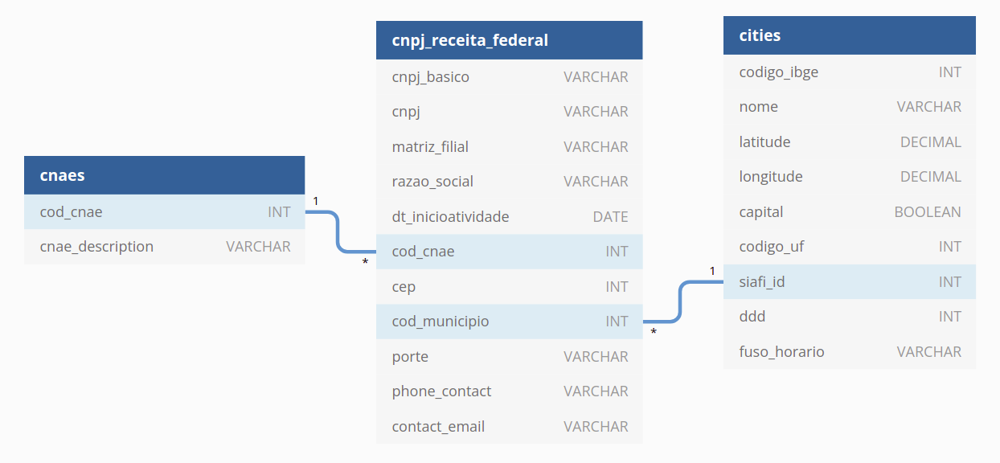

## Dataset information

For this project the dataset of **Federal Revenue of *Brazil* (RFB)** will be used. The dataset contains public information about Brazilian companies such industry activity description ([CNAE](https://pt.wikipedia.org/wiki/Classifica%C3%A7%C3%A3o_Nacional_de_Atividades_Econ%C3%B4micas)), address, contacts information, business size and company age. The fully dataset contains about ten tables distributed main tables and  dimension tables. The three main tables are:

- **Establishments:** contains information about [CNPJ](https://en.wikipedia.org/wiki/CNPJ) (National Register of Legal Entities). The *CNPJ* consists of a 14-digit number formatted as  XX.XXX.XXX/0001-XX — **The first eight digits identify the company**, the four digits after the  slash identify the branch or subsidiary ("0001" defaults to the  headquarters), and the last two are check digits. The *CNPJ* must be informed on any invoice of any company, as well as on the packaging of any industrialized product. In this dataset each establishments of an specific company will by represented by one record.
- **Company** - Contains information about a company, such business size and [legal nature](https://pt.wikipedia.org/wiki/Natureza_jur%C3%ADdica). 
- **Partners**: - Contains information about company partners and their respective roles.

The others tables are dimension tables, that describes information contained in the main three tables. They are:

- CNAE -  identifies the establishment activity 
- Country.
- Cities. 
- Legal nature description.
- Status
- Reasons for the current status (if applicable).
- Roles description (for the company partners).

### Dataset size

The dataset contains more than 100 million rows considering all the subdatasets provided (Companies, Stablishments, Business partners..). For the company data, the size is around 40 million rows and for stablishments data this number is arrount 55 million rows. This difference occurs because one company can have multiples establishments in the same registration number (The first eight digits identify of the CNPJ).

### Dataset updating

Based on the information provided by the **Federal Revenue of *Brazil* (RFB)**, this dataset is updated once a month.

## Use cases

For this project, the dataset will be prepared considering two scenarios:

#### Dataset considerations
For this project, it will be considering only the first two parts files (part-01.zip and part-02.zip) for stablishments and companies table due to AWS costs. Once the scripts run for these two parts, it can be scaled for the remaining parts if desired. 

### Data schema for s3 bucket 

#### Dataset dictionary:

**Stablishments data**:
| **Column**          | Type    | Description                                             |
| ------------------- | ------- | ------------------------------------------------------- |
| cnpj_basico         | string  | Root number of cnpj                                     |
| cnpj_ordem          | string  | Order number of cnpj                                    |
| cnpj_dv             | integer | Verification number of cnpj                             |
| cod_matfil          | string  | Head office or branch (1 for Head office; 0 for branch) |
| nome_fantasia       | integer | Branch name                                             |
| cod_sitcad          | date    | Stablishment status (active, inactive,..)               |
| dt_sitcad           | string  | Stablishment status date                                |
| codmot_sitcad       | string  | Status motive                                           |
| cidade_exterior     | string  | City exterior name                                      |
| cod_pais            | date    | Country code                                            |
| dt_inicioatividade  | integer | Start date of activity                                  |
| cod_cnae            | string  | Main activity code                                      |
| cod_cnae_secundario | string  | Secondaries activities codes                            |
| add_tipo_logradouro | string  | Address info                                            |
| add_logradouro      | string  | Address info                                            |
| add_numero          | string  | Address numeber                                         |
| add_complemento     | string  | Address complement                                      |
| add_bairro          | integer | District                                                |
| add_cep             | string  | postal-code                                             |
| add_uf              | integer | State                                                   |
| add_cod_mun         | string  | City code                                               |
| contact_ddd1        | string  | Phone 1 prefix                                          |
| contact_phone1      | string  | Phone 1 number                                          |
| contact_ddd2        | string  | Phone 2 prefix                                          |
| contact_phone2      | string  | Phone 2 number                                          |
| contact_ddd_fax     | string  | Fax prefix                                              |
| contact_fax         | string  | Fax number                                              |
| contact_email       | string  | Email contact                                           |
| cod_sitespecial     | date    | Special status code                                     |
| dt_sitespecial      | date    | Special status date                                     |

**Companies data**
| Column               | Type    | Description                             |
| -------------------- | ------- | --------------------------------------- |
| cnpj_basico          | string  | Root number of cnpj                     |
| razao_social         | string  | Company name                            |
| cod_natjuridica      | integer | Legal nature code                       |
| cod_qualiresponsavel | integer | Qualification of the responsible person |
| capital_social       | float   | Capital stock                           |
| cod_porte            | integer | Business size code                      |
| ente_fed             | string  | Country                                 |


For more data details, acess [this link](https://www.gov.br/receitafederal/pt-br/assuntos/orientacao-tributaria/cadastros/consultas/arquivos/NOVOLAYOUTDOSDADOSABERTOSDOCNPJ.pdf).

## Data cleansing

Inspecting the files, there are one common data correction that needs to be implemented. In both dataset the missing fields are represented with "" string characters. In this case, its necessary to replace these fields in order to properly parse the data types. Additionaly, for capital_social column in companies data, it was necessary to replace ",' by "." in order to parse data as float type.

In order to parse the other columns in the correct data type, a Schema of each table was set to the pyspark writer. In this case, fields that missmatch the correct data type was set as "null". After some investigations. For the two parts used in this dataset, it was < 1%. Considering the data usage is considered as tolerable.

Additionally, its worth mention that the encoding for the hole dataset is 'iso-8859-1'.

Considering th data application, only active stablishments are loaded to redshift table. By filtering the table stablishments using 'cod_sitcad == 2'

### Data model

Considering that the business goal of this project is to increase our maket share and monitoring the market health (scenario 01 and 02). Not all those field presented in stablishments and companies are necessary. For this reason the respective data model was used:



In order to create cnpj_receita_federal table, both stablishments data and companies data was merged. Only city column was keeped from address fields, because state can be retrieved from dimension table cities. Cities dimension table also contains latitude and longitude information, that can be used to plot a heat map for instance. 

Also contact fields was keep in case the users want to make contact with the potentials new clients. Finally, columns that represents the business size was added, mapping code values from its respectives descriptions. CNAE dimension table was also created from an external source, and contains the description of each activity, in order to allow filter stablishments that works with Services or Agricultural activities for instance.


### Data dictionary

#### cnaes table
| Column           | Type    | Description                                       |
| ---------------- | ------- | ------------------------------------------------- |
| cod_cnae         | int     | Code for the company activity                     |
| cnae_description | varchar | Describres the company activity based on cod_cnae |

#### cities table
| Column       | Type    | Description                      |
| ------------ | ------- | -------------------------------- |
| codigo_ibge  | int     | City code using IBGE pattern     |
| nome         | varchar | City name                        |
| latitude     | decimal | Latitude                         |
| longitude    | decimal | Longitude                        |
| capital      | Boolean | If the city is a capital or not. |
| codigo_uf    | int     | State code                       |
| siafi_id     | int     | City code using SIAFI pattern    |
| ddd          | int     | Phone prefix number of the city  |
| fuso_horario | varchar | Timezone                         |


#### cnpj_receita_federal table
| Column             | Type    | Description                                                  |
| ------------------ | ------- | ------------------------------------------------------------ |
| cnpj_basico        | varchar | Root number of CNPJ                                          |
| cnpj               | varchar | CNPJ full number                                             |
| matriz_filial      | varchar | Describes if the stablishment is the head office or a branch |
| razao_social       | varchar | Company name                                                 |
| dt_inicioatividade | date    | When the stablishments stated the operation                  |
| cod_cnae           | int     | Code of stablishment activity                                |
| cep                | int     | Zip code                                                     |
| cod_municipio      | int     | City code                                                    |
| porte              | varchar | Describes the business size                                  |
| phone_contact      | varchar | Phone contact with prefix                                    |
| contact_email      | varchar | Email contact                                                |

## Data quality checks
All the tests use Pytest Framework (check project instructions to get more information about running `pytest` on EMR Clusters).

Data quality checks includes:
- Data schema from s3 bucket (pyspark for transforming raw data check)

- No empty table in Redshift and match number of records between S3 source files and redshift tables

- Unique Key constraint: In this model, cnpj column should be unique (each stablishment has an unique CNPJ). Lets check if the total number of rows inside cnpj_receita federal table matches the total distinct number of CNPJs 


#### Test automation

The tests mentioned above are automated in `test_etl_process.py`. The results are showed below
```
----------------------------------------------------------------------
Ran 4 tests in 29.542s

OK
```

## Data pipeline

The datapipeline was developed using Amazon S3 service for storage, EMR Cluster running Spark for ETL script and Amazon Redshift as data warehouse storage.


Pyspark script and EMR Cluster was choosen to process the raw files because its fast to process large files using multiples nodes and its parallelization ability. Also, Pyspark allows to use the SchemaOnRead feature. This feature was used to merge stablishemnts and companies table with no needs of write staging tables in redshift, that is very cost effective.

In this pipeline, EMR Cluster already writes the fact table formatted file in s3 bucket. Considering any scenario changes in this project, the cleaned data can be stored in s3 bucket as an intermediated stage for further modifications in fact table or another change the the datawarehouse schema if necessary. 

### Dataset usages

Which cities there are more companies with this CNAE. 

```
SELECT c.nome AS city, 
       count(a.*) AS total_stablishments
FROM cnpj_receita_federal a 
JOIN cnaes b ON a.cod_cnae = b.cod_cnae
JOIN cities c ON c.siafi_id = a.cod_municipio
GROUP BY c.nome 
ORDER 2 desc
LIMIT 5
```

as result, the top 5 cities where this client can aim to expand its business would be

| **city**       | **cnae_description**                                    | **total_stablishments** |
| :------------- | :------------------------------------------------------ | :---------------------- |
| São Paulo      | Comércio varejista de artigos do vestuário e acessórios | 2942                    |
| Rio de Janeiro | Comércio varejista de artigos do vestuário e acessórios | 964                     |
| Curitiba       | Comércio varejista de artigos do vestuário e acessórios | 639                     |
| Brasília       | Comércio varejista de artigos do vestuário e acessórios | 544                     |
| Belo Horizonte | Comércio varejista de artigos do vestuário e acessórios | 533                     |

Now, let's imagine that he wants to know which company in Sao Paulo with this cnae have more branches. Considering that if he converts a company with many branches as his client, he can expand much faster.

```
SELECT a.cnpj_basico, a.razao_social, count(a.*) AS total_stablishments
FROM cnpj_receita_federal a 
JOIN cities c ON c.siafi_id = a.cod_municipio
WHERE a.cod_cnae = 4781400 AND c.nome = 'São Paulo'
GROUP BY 1, 2
ORDER BY 3 DESC
```

Returns 

| **cnpj_basico** | **razao_social**                             | **total_stablishments** |
| :-------------- | :------------------------------------------- | :---------------------- |
| 61189288        | MARISA LOJAS S.A.                            | 15                      |
| 47100110        | VIA VENETO ROUPAS LTDA                       | 11                      |
| 49669856        | RESTOQUE COMERCIO E CONFECCOES DE ROUPAS S/A | 10                      |
| 53966834        | TNG COMERCIO E INDUSTRIA DE ROUPAS LTDA      | 10                      |
| 78876950        | CIA. HERING                                  | 8                       |
| 45242914        | C&A MODAS S.A.                               | 7                       |


In this case, the client could get the contact information about the first 3 companies for instance, using:
```
SELECT a.cnpj_basico,
	a.razao_social, 
    a.cep,
    a.dt_inicioatividade,
    a.matriz_filial,
    a.phone_contact,
    a.contact_email
FROM cnpj_receita_federal a 
WHERE a.cnpj_basico IN (61189288, 47100110, 49669856);
```

## Considerations about other scenarios 
### If the data was increased by 100x.
 In this case it would be better use the Lake Formation with AWS Glue. AWS Glue crawlers can infer data schema based on Amazon S3 bucket and identifies tables schemas. Also, AWS Glue Jobs can be used to transform raw data, and store the files in parquet format in another bucket for the trasnformed files. Then, AWS Athena could be used to query data using S3 partitioned folders for better performance. In Redshift case, a greater number of clusters would be necessary to manage the data. Optimized definition of DistKey and SortKey would be required, since these dataset can be very skewed, considering the different economic regions in Brazil (One state can contains more companies and stablishments than other regions).

### If the pipelines were run on a daily basis by 7am.
In this scenario, where new files would be generated every morning, a event driven pipeline would be requeried, using AWS Trigger and Step Functions to activate each step of the pipeline. 

### If the database needed to be accessed by 100+ people.
In this case, [AWS Redshift](https://docs.aws.amazon.com/redshift/latest/mgmt/amazon-redshift-limits.html) can handle up to 500 connections. 


## Technologies used in this project
- AWS S3 for data storage;
- Pystest framework for tests;
- EMR Cluster using pySpark for large data set data processing to transform staging table to dimensional table
- Amazon Redshift to store the dimensional model.

#### Project Instructions

1. Download the dataset files in the link provided below on dataset information secction.

2. Upload the csv files in Amazon S3 bucket in the respective format.
    - bucket_name/stablishments/raw
    - bucket_name/companies/raw

3. Create an EMR Cluster an stablishes a tunnel connection with your local machine

4. Create an Redshift Cluster in the same region of your EMR Cluster

4. Copy the source files in etl folder to the EMR cluster machine using tunnel connection.

5. Install the custom package etl and all the required dependencies on your EMR Cluster using `pip sudo install .` 

6. Provide your aws credentials and the file paths in `aws_paths.cfg` 

7. On your ERM Cluster run `spark-submit transform_raw_files.py`

8. Then, run `python3 load_data.py`

9. Finally, run `pytest test/` to run the tests. In this case, it's necessary to configure the Pyspark path. [Check this tutorial](https://stackoverflow.com/questions/31976353/amazon-emr-pyspark-module-not-found)

